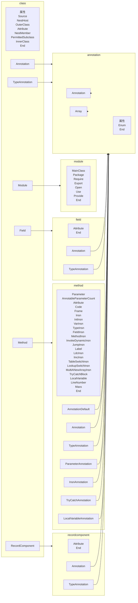
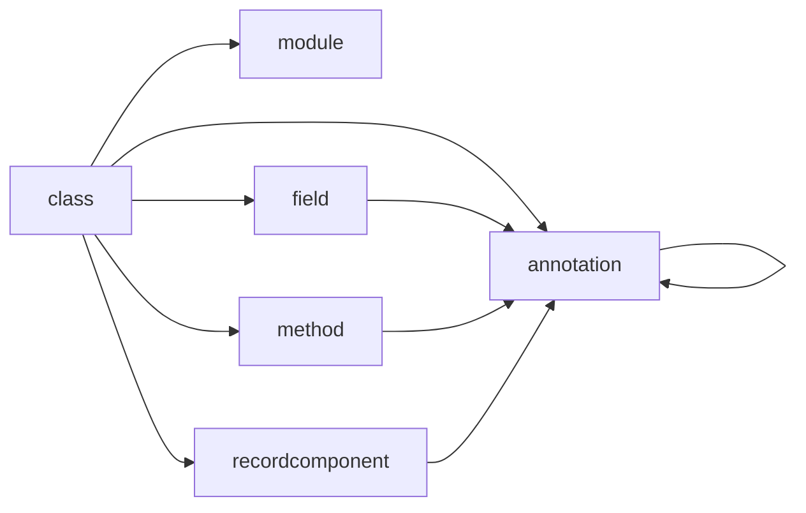

_本文档使用markdown语法，包含了mermaid绘图，请使用支持mermaid语法的markdown编辑器或阅读器打开。_

# Java中的Function

## 从面向对象到面向过程

## JVM字节码的结构

### 字节码指令结构示意

```mermaid
flowchart LR

subgraph class
	cl[属性\nSource\nNestHost\nOuterClass\nAttribute\nNestMember\nPermittedSubclass\nInnerClass\nEnd]
	cl.Module[Module]
	cl.Annotation[Annotation]
	cl.TypeAnnotation[TypeAnnotation]
	cl.RecordComponent[RecordComponent]
	cl.Field[Field]
	cl.Method[Method]
end

subgraph module
	md[MainClass\nPackage\nRequire\nExport\nOpen\nUse\nProvide\nEnd]
end

subgraph annotation
	an[属性\nEnum\nEnd]
	an.Annotation[Annotation]
	an.Array[Array]
end

subgraph field
	fl[Attribute\nEnd]
	fl.Annotation[Annotation]
	fl.TypeAnnotation[TypeAnnotation]
end

subgraph method
	mt[Parameter\nAnnotableParameterCount\nAttribute\nCode\nFrame\nInsn\nIntInsn\nVarInsn\nTypeInsn\nFieldInsn\nMethodInsn\nInvokeDynamicInsn\nJumpInsn\nLabel\nLdcInsn\nIincInsn\nTableSwitchInsn\nLookupSwitchInsn\nMultiANewArrayInsn\nTryCatchBlock\nLocalVariable\nLineNumber\nMaxs\nEnd]
	mt.AnnotationDefault[AnnotationDefault]
	mt.Annotation[Annotation]
	mt.TypeAnnotation[TypeAnnotation]
	mt.ParameterAnnotation[ParameterAnnotation]
	mt.InsnAnnotation[InsnAnnotation]
	mt.TryCatchAnnotation[TryCatchAnnotation]
	mt.LocalVariableAnnotation[LocalVariableAnnotation]
end

subgraph recordcomponent
	rc[Attribute\nEnd]
	rc.Annotation[Annotation]
	rc.TypeAnnotation[TypeAnnotation]
end

cl.Module --> module
cl.Annotation & cl.TypeAnnotation --> annotation
cl.RecordComponent --> recordcomponent
cl.Field --> field
cl.Method --> method

an.Annotation & an.Array --> annotation

fl.Annotation & fl.TypeAnnotation --> annotation

mt.AnnotationDefault & mt.Annotation & mt.TypeAnnotation & mt.ParameterAnnotation & mt.InsnAnnotation & mt.TryCatchAnnotation & mt.LocalVariableAnnotation --> annotation

rc.Annotation & rc.TypeAnnotation --> annotation
```

### 简化的引用关系

```mermaid
flowchart LR

c[class]

c --> module
c --> annotation
c --> recordcomponent
c --> field
c --> method

field --> annotation

method --> annotation

recordcomponent --> annotation

annotation --> annotation
```

