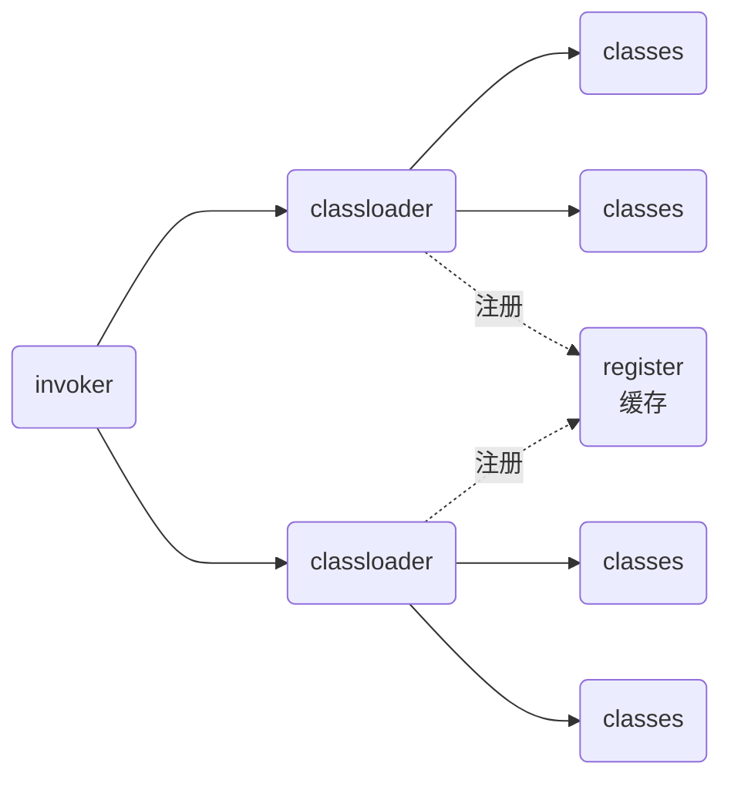

# Runtime

```mermaid
flowchart LR

i(invoker) ---> cl(classloader) & cl2(classloader)

r(register\n缓存)

cl --> c1(classes) & c2(classes)
cl2 --> c3(classes) & c4(classes)

cl & cl2 -.->|注册| r
```

