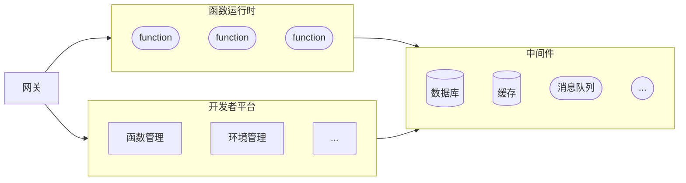

# 拓扑结构

```mermaid
flowchart LR

gateway[网关]

subgraph faas[函数运行时]
    a([function])
    b([function])
    c([function])
end

subgraph mid[中间件]
    database[(数据库)]
    redis[(缓存)]
    mq([消息队列])
    others([...])
end

subgraph dev[开发者平台]
    函数管理
    环境管理
    devOthers[...]
end

gateway --> faas
gateway --> dev

faas --> mid
dev --> mid

```