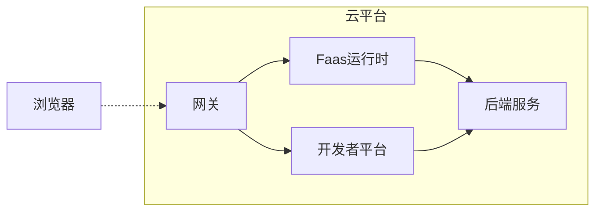
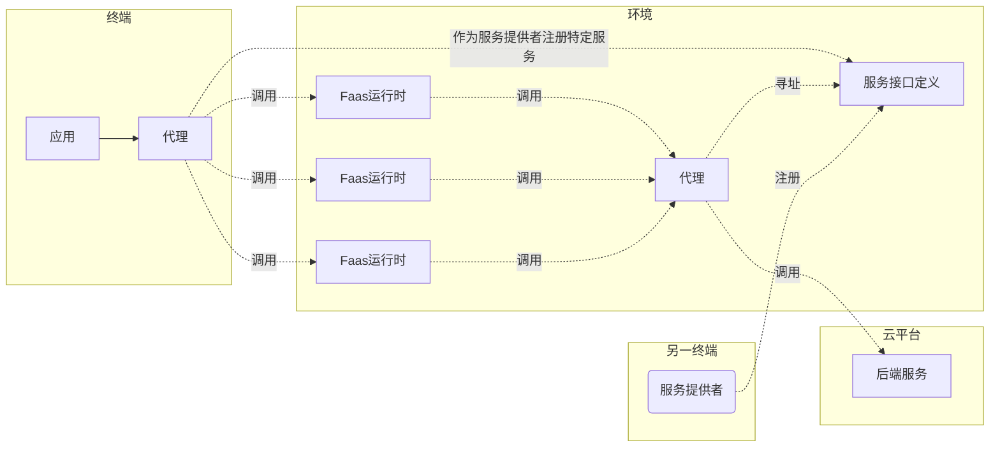
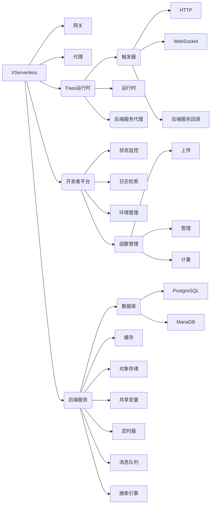

_本文档使用markdown语法，包含了mermaid绘图，请使用支持mermaid语法的markdown编辑器或阅读器打开。_

# 关于XServerless

XServerless有两个目的。一个是降低Serverless应用开发的门槛，设计和开发人员可以沿用原有的设计与开发方式，以单体或微服务的形式开发应用，再通过XServerless提供的开发者平台拆分为可以执行的函数式服务，跑在Faas运行中；另一个目的是尝试推进普适计算的落地，即将Faas运行时部署到环境的各个智能设备中，再通过将应用拆分出来的函数式服务分发到各个设备上执行，从而实现普适计算的效果。

# XServerless模块

XServerless包括服务器版本和普适计算版本。

## 服务器版本

包括网关、Faas运行时、开发者平台和后端服务几个部分。

## 普适计算版本

包括代理，Faas运行时，后端服务。

## 全部模块

### 网关

将请求分发到各个Faas运行时。

### 代理

正向代理，将请求转发到环境中的Faas运行时。

### Faas运行时

执行函数服务的环境。

#### 触发器

接受请求，调用运行时创建函数实例并执行。

##### HTTP

接受HTTP请求。

##### WebSocket

接受WebSocket请求。

##### 后端服务回调

接受后端服务回调请求，包括定时器回调、消息队列的Consumer回调等。

#### 运行时

执行函数服务的环境，创建并管理函数实例。

#### 后端服务代理

调用后端服务的正向代理，sidecar方式。

### 开发者平台

面向函数应用开发者的服务平台。

#### 状态监控

监控所属环境中各个函数的执行情况。

#### 日志检索

应用业务日志检索。

#### 环境管理

创建和管理运行环境。

#### 函数管理

管理业务函数。

##### 上传

上传应用，并拆分为函数入库。

##### 管理

业务函数的增删改查。

##### 计量

函数的调用次数计量。

### 后端服务

将中间件和含状态的服务封装为后端服务。

#### 数据库

数据库中间件。包括PostgreSQ和MariaDB两种数据库服务。

#### 缓存

Redis服务。

#### 对象存储

对象存储功能。（后续计划将文件系统也封装进来）

#### 共享变量

一部分无法转为无状态函数的业务逻辑，将其封装为共享变量，以队列的方式进行读取确保一致性。

#### 定时器

定时器服务。注册、反注册定时器与函数回调。

#### 消息队列

消息队列服务封装。

#### 搜索引擎

ElasticSearch服务。

